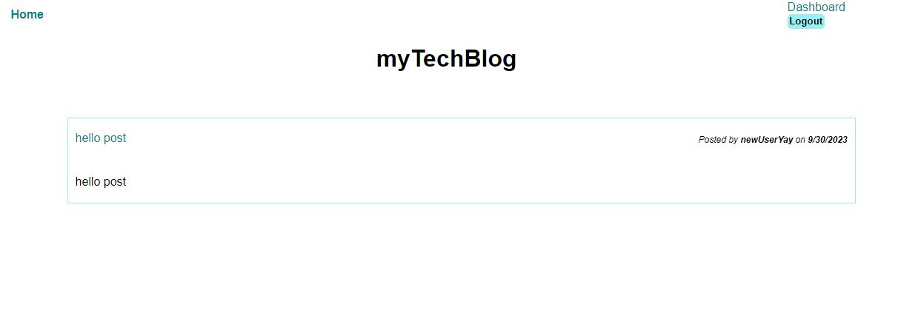

# myTechBlog

## Table of Contents

* [Description](#description)
* [Installation](#installation)
* [Usage](#usage)
* [License](#license)
* [Sources](#sources)

## Description

myTechBlog is an application for users that want to talk tech.  Users can create posts and comments to connect with other tech-minded individuals.

Heroku deployment:

https://mytechblogsquyres-d2520e34ead7.herokuapp.com/ 

GitHub:

https://github.com/SarahSquyres/myTechBlog 

## Installation

To install the necessary dependencies, run the following command:

npm i 

## Usage

To use this application, run the following command:

npm start

## License

This project is licensed under the MIT license.

## Sources

I would like to first thank my tutor and TAs for supporting me as I develop this project.  

Other Sources:
https://github.com/OwaisIslam/tech-blog
Google Bard
Xpert Learning Assistant

